# 🤖 AI Sales Intelligence System

<div align="center">


**Transforming Raw Retail Data into Intelligent Business Decisions**

*End-to-end Machine Learning platform for Lead Scoring, RFM Customer Segmentation, and CLV Prediction built on ~1 million real transactions*

</div>

---

## 📌 Overview

The **AI Sales Intelligence System** is a complete data science project built on the **UCI Online Retail II Dataset** (~1,066,000 transactions). It combines a PostgreSQL data engineering pipeline, Python machine learning models, and an interactive **Streamlit web application** — delivering real-time customer intelligence to business users.

### 💼 Key Business Numbers (from real data)

| Metric | Value |
|--------|-------|
| 🧑‍🤝‍🧑 Total Customers Analysed | **5,878** |
| 💷 Total Revenue | **£17.74 Million** |
| 💷 Avg Revenue per Customer | **£3,018.62** |
| 📦 Total Transactions | **~1,066,000** |
| 🏆 Champion Customers | **1,747** (generate £12.69M — 71.5% of total revenue) |
| ⚠️ At-Risk Customers | **471** (£507K revenue at risk) |

---

## 🖥️ Executive Dashboard

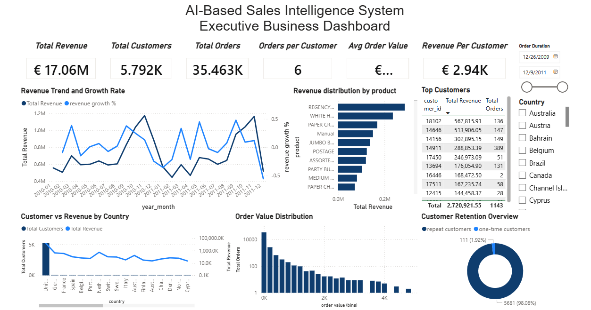

*Power BI dashboard showing £17.06M total revenue, 5,792 customers, 35,463 orders, with revenue trends, top products, country analysis, and customer retention overview (98.08% repeat customers).*

---

## 🎯 System Modules

| Module | Purpose | Output |
|--------|---------|--------|
| 🎯 **Lead Scoring** | Score every customer 0–100 using ML | Priority sales targeting |
| 👥 **Customer Intelligence** | RFM segmentation into 5 tiers | Segment-based marketing |
| 💰 **CLV Prediction** | Predict future revenue per customer | Retention & investment decisions |
| 📊 **Executive Dashboard** | Power BI KPI report | C-level business overview |

---

## 👥 RFM Customer Segmentation

### Customer Distribution Across Segments

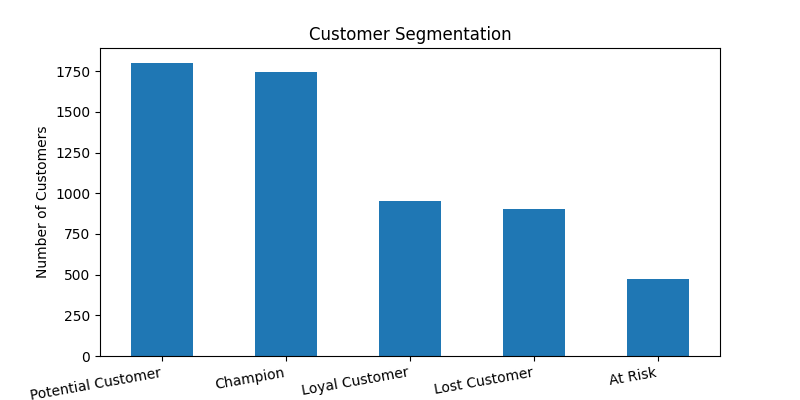

| Segment | Customers | Revenue Generated | % of Total Revenue |
|---------|-----------|------------------|-------------------|
| 🏆 Champion | 1,747 | £12,686,640 | **71.5%** |
| 💛 Loyal Customer | 955 | £2,924,571 | 16.5% |
| 🌱 Potential Customer | 1,803 | £1,234,915 | 7.0% |
| ⚠️ At Risk | 471 | £507,745 | 2.9% |
| ❌ Lost Customer | 902 | £389,556 | 2.2% |

> 💡 **80/20 in action:** The top Champion segment — just 29.7% of customers — drives **71.5% of all revenue (£12.69M)**. Protecting this segment is the single highest-ROI business action.

### Revenue Contribution by Segment

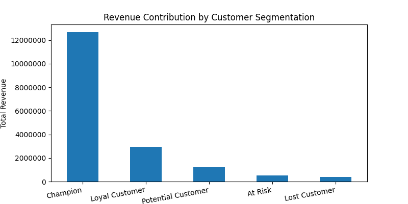

### Top RFM Score Combinations

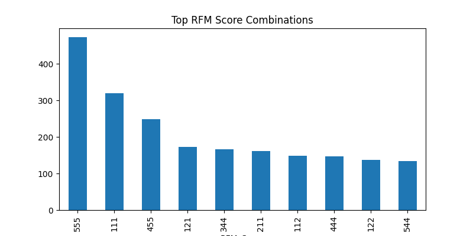

*RFM score 555 is the most common — nearly 470 customers score maximum across all three dimensions, forming the core Champion base.*

### Segment Strategy

| Segment | Rule | Business Action |
|---------|------|----------------|
| 🏆 Champion | R≥4 & F≥4 | Loyalty rewards, VIP programs, upsell premium products |
| 💛 Loyal Customer | R≥3 & F≥3 | Personalized campaigns, early access, referral programs |
| 🌱 Potential Customer | R≥3 & F≤2 | Conversion campaigns, first-repeat purchase incentives |
| ⚠️ At Risk | R≤2 & F≥3 | Urgent win-back emails, exclusive discounts |
| ❌ Lost Customer | R≤2 & F≤2 | Remarketing with strong incentives or re-acquisition ads |

---

## 🎯 Lead Scoring

Predicts a continuous lead score (0–100) per customer using 9 behavioral and transactional features. Scores are log-transformed during training to handle skew, then rescaled to 0–100 for business use.

### Lead Score Distribution (from 5,878 customers)

| Lead Tier | Score Range | Customers | Action |
|-----------|-------------|-----------|--------|
| 🟢 High Value | ≥ 70 | 14 | Immediate priority outreach |
| 🟡 Medium Value | 40 – 70 | 1,397 | Nurture & upsell campaigns |
| 🔴 Low Value | < 40 | 4,467 | Broad awareness marketing |

### Lead Scoring Models — Performance

| Model | MAE | RMSE | R² Score |
|-------|-----|------|----------|
| Linear Regression | 2.819 | 3.834 | 0.9250 |
| Random Forest | 1.443 | 1.931 | 0.9810 |
| **✅ Gradient Boosting** | **0.451** | **0.606** | **0.9981** |

> 🏆 Gradient Boosting achieves **R² = 0.9981** — explaining 99.8% of variance in lead scores with an average error of just 0.45 points on a 0–100 scale.

### Lead Scoring — Actual vs Predicted Plots

| Gradient Boosting ✅ Best | Random Forest | Linear Regression |
|---|---|---|
| 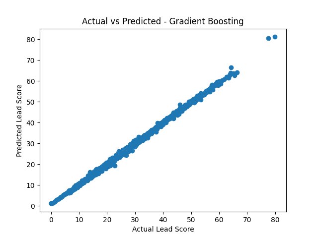 | 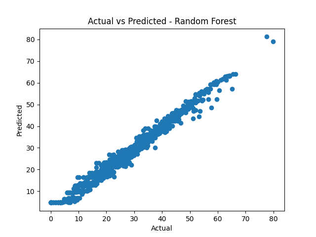 | 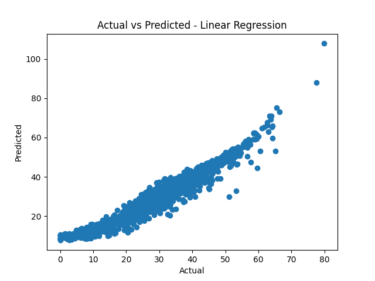 |

### Feature Importance — What Drives Lead Score?

| Rank | Feature | RF | GB | Insight |
|------|---------|----|----|---------|
| 🥇 1 | **ProductDiversity** | 83.1% | 77.1% | Customers buying more unique products are far more valuable |
| 🥈 2 | **email_click_rate** | 14.3% | 18.5% | Engagement is a strong purchase-intent signal |
| 🥉 3 | **Recency** | 2.1% | 3.5% | Recent buyers are warmer leads |
| 4 | Frequency | 0.18% | 0.35% | Purchase count matters but less than diversity |

> 💡 **ProductDiversity** (avg = 82 unique products/customer, max = 2,550) single-handedly drives **77–83% of the lead prediction**. Sales teams should prioritise customers who explore the full product catalogue.

---

## 💰 Customer Lifetime Value (CLV) Prediction

CLV is predicted using log-transformed regression to handle extreme revenue skew — the raw distribution is heavily right-skewed (most customers £0–£500, a few above £10K), while the log distribution is approximately normal, making it suitable for ML.

### Why Log Transformation?

| Raw Distribution | Log-Transformed Distribution |
|---|---|
| 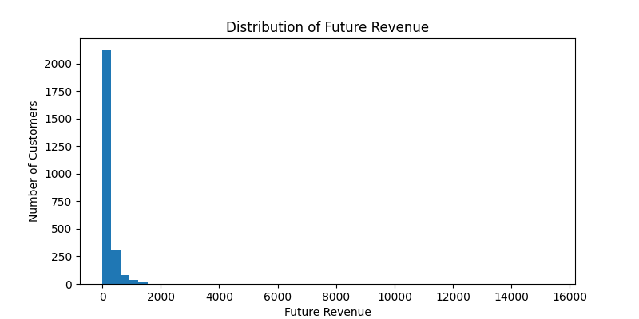 | 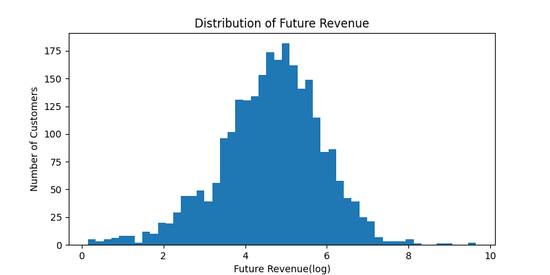 |

The raw histogram shows extreme right skew. After log transformation, the distribution becomes near-normal — enabling accurate regression.

### CLV Model Results

| Model | MAE | RMSE | R² Score |
|-------|-----|------|----------|
| Linear Regression | 0.830 | 1.076 | 0.182 |
| Random Forest | 0.826 | 1.081 | 0.174 |
| **✅ Gradient Boosting** | **0.806** | **1.043** | **0.232** |

*Note: CLV R² scores are lower by design — predicting future revenue is inherently harder than scoring historical behavior. Gradient Boosting achieves the best results across all metrics.*

### CLV Actual vs Predicted

| Linear Regression | Random Forest | Gradient Boosting |
|---|---|---|
| 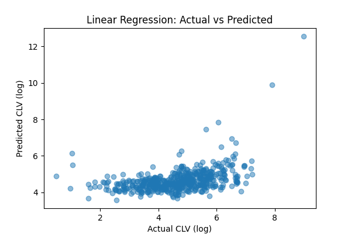 | 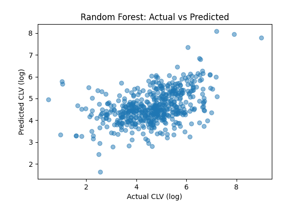 | 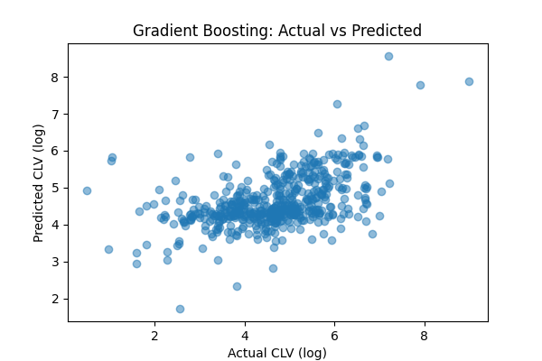 |

### Feature Importance for CLV

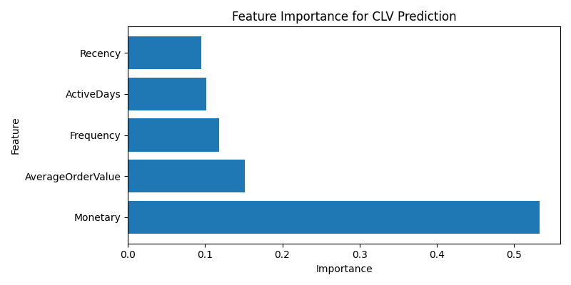

| Rank | Feature | Importance | Insight |
|------|---------|-----------|---------|
| 🥇 1 | **Monetary** | 53% | Past spend is the strongest predictor of future spend |
| 🥈 2 | **AverageOrderValue** | 15% | High AOV customers tend to remain high-value |
| 🥉 3 | **Frequency** | 12% | More frequent buyers return more reliably |
| 4 | **ActiveDays** | 10% | Longer customer lifespan = more future transactions |
| 5 | **Recency** | 10% | Recent activity signals continued engagement |

### Feature Correlation with CLV

| Orange Heatmap | Green Heatmap |
|---|---|
| 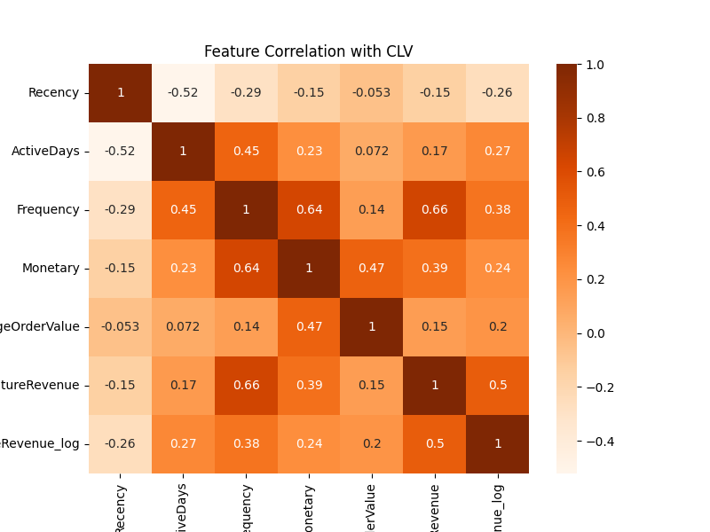 | 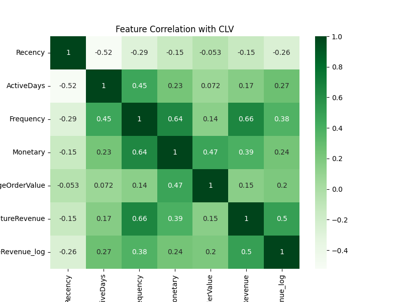 |

Key correlations with future revenue: **Frequency (0.66)** and **Monetary (0.39)** are the strongest predictors. **Recency is negatively correlated (−0.26)** — customers who haven't purchased recently contribute less future value.

### Monetary Value vs Future Revenue

| Raw Scale | Log Scale |
|---|---|
| 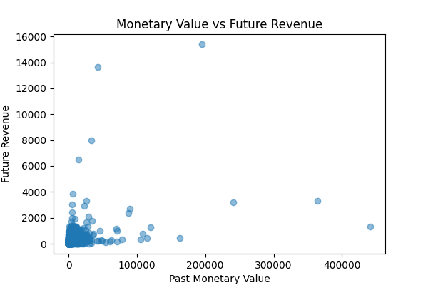 | 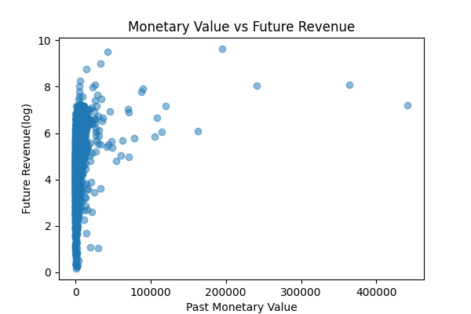 |

### CLV Segments

| CLV Range | Tier | Strategy |
|-----------|------|---------|
| ≥ £174 | 🟢 High Value | Loyalty programs, VIP perks, premium upsell |
| £65–£174 | 🟡 Medium Value | Personalised marketing, upselling |
| < £65 | 🔴 Low Value | Discounts, re-engagement campaigns |

---

## 🗄️ SQL Analytics Pipeline

All data engineering is done in **PostgreSQL** using advanced SQL:

| Script | Key Analyses |
|--------|-------------|
| `data_importing_and_preprocessing.sql` | Schema creation, CSV import, removing negatives & nulls, backup table |
| `business_understanding.sql` | Revenue totals, monthly trends, country breakdown, best-selling products |
| `customer_analysis.sql` | Per-customer AOV, lifespan, one-time vs. repeat buyer analysis |
| `advance_business_analytics.sql` | Window functions: revenue rankings, purchase intervals, revenue percentiles |
| `rfm_analysis.sql` | Full RFM scoring with `NTILE(5)` + 5-tier segmentation `CASE` logic |

**Sample — RFM Scoring with Window Functions:**
```sql
WITH rfm AS (
    SELECT customer_id,
           MAX(invoice_date) AS last_purchase,
           COUNT(DISTINCT invoice) AS frequency,
           SUM(price * quantity) AS monetary
    FROM online_retail GROUP BY customer_id
),
scored AS (
    SELECT customer_id,
           DATE_PART('day', MAX(last_purchase) OVER() - last_purchase) AS recency,
           frequency, monetary,
           NTILE(5) OVER(ORDER BY recency DESC) AS r_score,
           NTILE(5) OVER(ORDER BY frequency)    AS f_score,
           NTILE(5) OVER(ORDER BY monetary)     AS m_score
    FROM rfm
)
SELECT *, CASE
    WHEN r_score >= 4 AND f_score >= 4 THEN 'Champion'
    WHEN r_score >= 3 AND f_score >= 3 THEN 'Loyal Customer'
    WHEN r_score >= 3 AND f_score <= 2 THEN 'Potential Customer'
    WHEN r_score <= 2 AND f_score >= 3 THEN 'At Risk'
    ELSE 'Lost Customer'
END AS segment
FROM scored;
```

---

## 🚀 Getting Started

### Prerequisites
- Python 3.8+
- PostgreSQL 13+
- Power BI Desktop *(optional)*

### Installation

```bash
# 1. Clone the repository
git clone https://github.com/your-username/AI-Sales-Intelligence-System.git
cd AI-Sales-Intelligence-System

# 2. Install dependencies
pip install -r requirements.txt

# 3. Set up the database — run SQL files in this order:
#    1. sql/data_importing_and_preprocessing.sql
#    2. sql/data_importing_and_exploring.sql
#    3. sql/business_understanding.sql
#    4. sql/rfm_analysis.sql

# 4. Launch the app
streamlit run app.py
```

### `requirements.txt`

streamlit>=1.28.0
pandas>=1.5.0
numpy>=1.23.0
scikit-learn>=1.2.0
joblib>=1.2.0
matplotlib>=3.6.0

---

## ⚠️ Important — Update Hardcoded Paths Before Running

This project was developed on a Windows machine. Several files contain **absolute paths** specific to the original development environment and **must be updated** to match your own system before running.

### Files to Update

**`sql/data_importing_and_preprocessing.sql`**
```sql
-- CHANGE THIS to your own CSV file location:
COPY online_retail FROM 'E:/SEM 8/Sales_Intelligence_System/Datasets/Online Retail Dataset/online_retail_I.csv'
DELIMITER ',' CSV HEADER;

-- UPDATE to your path:
COPY online_retail FROM 'C:/your-path/online_retail_I.csv'
DELIMITER ',' CSV HEADER;
```

**`sql/data_importing_and_exploring.sql`**
```sql
-- CHANGE THIS:
COPY customer_rfm_leadscore FROM 'E:/SEM 8/Sales_Intelligence_System/.../lead_scoring_final.csv'
DELIMITER ',' CSV HEADER;

-- UPDATE to your path:
COPY customer_rfm_leadscore FROM 'C:/your-path/lead_scoring_final.csv'
DELIMITER ',' CSV HEADER;
```

**`pages/dashboard.py`**
```python
# CHANGE THIS hardcoded Windows path:
st.image(r"E:\SEM 8\Sales_Intelligence_System\...\executive_dashboard.png")

# UPDATE to a relative path (works on any machine):
st.image("data/executive_dashboard.png")
```

**`pages/rfm_analysis.py`**
```python
# CHANGE THIS:
return pd.read_csv(r"data\rfm_analysis.csv")

# UPDATE to forward-slash relative path (works on Windows, Mac & Linux):
return pd.read_csv("data/rfm_analysis.csv")
```

### Quick Rule
> Use **relative paths** (e.g. `"data/rfm_analysis.csv"`) instead of **absolute paths** (e.g. `"E:/SEM 8/.../rfm_analysis.csv"`). Relative paths work from any machine as long as the folder structure matches the repository.

---

## 🗂️ Project Structure

AI-Sales-Intelligence-System/
├── app.py                            # Streamlit multi-tab application
├── requirements.txt
├── .gitignore
├── README.md
├── executive_dashboard.pbix          # Power BI file
├── pages/
│   ├── lead_scoring.py               # Lead Scoring UI & ML
│   ├── rfm_analysis.py               # Customer Intelligence UI
│   ├── clv_prediction.py             # CLV Prediction UI & ML
│   └── dashboard.py                  # Power BI embed
├── models/
│   ├── linear_regression_model.pkl
│   ├── random_forest_model.pkl
│   ├── gradient_boosting_model.pkl
│   ├── linear_rig.joblib
│   ├── random_for.joblib
│   └── gradient_boost.joblib
├── data/
│   ├── rfm_analysis.csv
│   ├── lead_scoring_final.csv
│   ├── clv_model_comparison.csv
│   ├── executive_dashboard.png
│   ├── Customer_segmentation.png
│   ├── Revenue_Contribution.png
│   ├── top_rfm_combination.png
│   ├── clv_feature_importance.png
│   ├── clv_feature_correlation.png
│   ├── clv_feature_correlation_log.png
│   ├── clv_target_distribution.png
│   ├── clv_target_distribution_log.png
│   ├── monetary_vs_clv.png
│   ├── monetary_vs_clv_log.png
│   ├── lr_actual_vs_pred.png
│   ├── rf_actual_vs_pred.png
│   ├── xg_actual_vs_pred.png
│   ├── lr_model_results.txt
│   ├── rf_model_results.txt
│   └── xg_model_results.txt
├── assets/
│   ├── logistic_reg/
│   │   ├── lr_regression_metrics.csv
│   │   ├── feature_importance_lr.csv
│   │   ├── actual_vs_pred_lr.png
│   │   ├── residual_plot_lr.png
│   │   ├── cm_lr-checkpoint.png
│   │   └── roc_lr-checkpoint.png
│   ├── random_forest/
│   │   ├── rf_regression_metrics.csv
│   │   ├── feature_importance_rf.csv
│   │   ├── feature_importance_rf.png
│   │   ├── actual_vs_pred_rf.png
│   │   └── residual_plot_rf.png
│   └── gradient_boost/
│       ├── gb_regression_metrics.csv
│       ├── feature_importance_gb.csv
│       ├── feature_importance_gb.png
│       ├── actual_vs_pred_gb.png
│       └── residual_plot_gb.png
├── notebooks/
│   ├── eda.ipynb
│   ├── eda_and_lead_scoring.ipynb
│   ├── model_training.ipynb
│   ├── clv.ipynb
│   └── clv_modeling.ipynb
└── sql/
├── data_importing_and_preprocessing.sql
├── data_importing_and_exploring.sql
├── business_understanding.sql
├── customer_analysis.sql
├── advance_business_analytics.sql
└── rfm_analysis.sql

---

## 🛠️ Tech Stack

| Layer | Technology |
|-------|-----------|
| **Database** | PostgreSQL 13+ |
| **Data Engineering** | SQL — CTEs, Window Functions, NTILE |
| **Analysis** | Python, Pandas, NumPy |
| **Machine Learning** | Scikit-learn (Linear Regression, Random Forest, Gradient Boosting) |
| **Web Application** | Streamlit |
| **Visualization** | Matplotlib |
| **BI Reporting** | Microsoft Power BI |
| **Notebooks** | Jupyter Notebook |

---

## 📄 Dataset

**UCI Online Retail II** — UK-based e-commerce (2009–2011)

| File | Rows |
|------|------|
| `online_retail_I.csv` | ~525,000 |
| `online_retail_II.csv` | ~541,000 |
| **Total after cleaning** | **~5,878 unique customers** |

> 📥 Download from [UCI ML Repository](https://archive.ics.uci.edu/ml/datasets/Online+Retail+II) — raw CSVs not included in this repo due to file size.

---

## 👤 Author

**Chandresh Sarvaiya** — B.Tech Final Year, Semester 8  
📧 chandreshsarvaiya@gmail.com  
🔗 [LinkedIn](https://www.linkedin.com/in/chandresh-sarvaiya-42449325a/) · [GitHub]((https://github.com/Chandresh-Sarvaiya?tab=repositories))

---

## 📄 License

MIT License — see [LICENSE](LICENSE) for details.

---

<div align="center">

⭐ **Star this repo if it helped you!** ⭐

</div>
